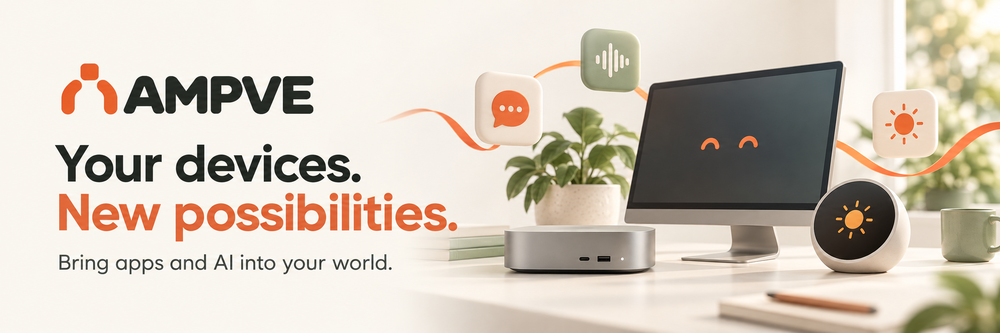
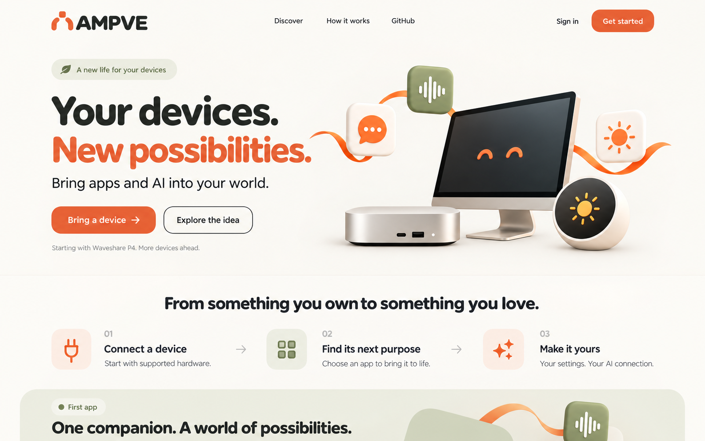

**Bring apps and AI into your world.**

AMPVE gives the devices you already own new ways to help, create, and connect. Start with supported hardware, choose an application, and make it yours.

Our first experience is **AMPVE Companion**: an expressive AI companion that listens, speaks, and lives on a small screen. It is the first application in a broader vision of bringing useful software and AI to everyday hardware.

**Current status:** Django platform foundation with an English frontend, private accounts, encrypted provider connections and an experimental browser voice preview; Lucas reports a successful OpenAI conversation, while Gemini remains unvalidated. The first physical 7B completed signed Wi-Fi OTAs through `0.1.17-visual-console-dev` sequence 8; Lucas confirms its preceding display/touch/Wi-Fi behavior, and the new authenticated semantic console completed a live physical-mode session with distinct device acknowledgements for mouse, touch and keyboard navigation. Future headless devices can use the same bounded virtual-display language. Speaker output, local console-stop observation, physical restoration and interrupted-update rollback remain pending. See the [visual console](docs/runbooks/VISUAL_CONSOLE.md), [native firmware](docs/runbooks/NATIVE_FIRMWARE.md) and [platform](docs/runbooks/PLATFORM.md) runbooks.

Follow the [ESP32 delivery Project](https://github.com/users/Lucas-hX/projects/10) and [task-tracking guide](docs/PROJECT_TRACKING.md) for browser onboarding, private backups, device management, recoverable Wi-Fi updates and firmware efficiency.

## The first experience

1. Sign in to your AMPVE workspace.
2. Add your own Gemini or OpenAI API connection.
3. Connect a supported device and follow the browser-based setup.
4. Activate Companion and choose its name, voice, and personality.
5. Manage its settings and software from AMPVE.

The first target is **Waveshare ESP32-P4-WIFI6-Touch-LCD-7B**. Voice and face interaction come first; the planned Razer Kiyo USB camera still requires hardware and firmware validation. Broader device support and additional applications are future work.

## Built on existing open-source foundations

| Foundation | Planned role |
|---|---|
| [XiaoZhi ESP32](https://github.com/78/xiaozhi-esp32) | Embedded companion firmware and supported-board integration |
| [ESP Web Tools](https://github.com/esphome/esp-web-tools) | Browser-based USB installation |
| [Pipecat](https://github.com/pipecat-ai/pipecat) | Gemini Live and OpenAI Realtime sessions on the server |

AMPVE adds the product experience: ownership, onboarding, application configuration, provider credentials, lifecycle management, and the adapter connecting the device protocol to Pipecat. These components require integration; they are not a preassembled stack.

The first backend will run on the owner's Debian VPS at OVH. Provider API keys stay on the server, and the device initiates outbound connections. The setup computer can disconnect once the board has working networking.

## Start here

- [Accepted architecture](docs/decisions/0001-platform-architecture.md)
- [Platform setup, operations, and current limits](docs/runbooks/PLATFORM.md)

| Document | Purpose |
|---|---|
| [Product direction](docs/PRODUCT_DIRECTION.md) | What AMPVE is, who the first experience serves, and how to present it |
| [MVP implementation brief](docs/MVP_IMPLEMENTATION.md) | Architecture, admin/test-user journey, hardware constraints, and acceptance criteria |
| [AGENTS.md](AGENTS.md) | Context and working instructions for the next Codex session or contributor |
| [Visual identity guide](images/ampve-brand-kit-v1/README.md) | Asset inventory, colors, copy, and frontend interpretation |
| [Visual gallery](images/ampve-brand-kit-v1/index.html) | Open locally in a browser to review all eight images |
| [Frontend tokens](images/ampve-brand-kit-v1/tokens.css) | Starting CSS values for the proposed identity |

GitHub displays the gallery's HTML source; clone or download this repository and open the file in a browser to view it.

## Design preview

The images are design concepts. Illustrated enclosures are not exact hardware photographs, and the pictured future devices are not a compatibility list. The brand centers on applications and possibilities; infrastructure details belong in the implementation experience.

## Repository scope

The repository contains the Django platform, migrations and tests, deployment definitions, architecture decisions, contributor guidance, and selected graphic assets. Credentials, dependencies, generated assets, firmware binaries, and private hardware backups stay outside Git.

Begin implementation with the milestones in the [MVP brief](docs/MVP_IMPLEMENTATION.md#11-implementation-sequence-and-completion-criteria). Do not treat mockups or roadmap items as already working features.

Validation update (2026-09-14): Lucas reports successful OpenAI API-key setup and a real browser voice conversation. Gemini remains unvalidated. The first 7B has completed installation, authenticated Wi-Fi registration and one settings acknowledgement; this is a limited device milestone, not full hardware acceptance. The revised Companion instructions discourage prompt disclosure; this is behavioral guidance, not a security guarantee. Provider keys remain outside model context and the model has no device-management tools.

Device-shell update (2026-09-13): Lucas reports a successful physical ROM inspection: ESP32-P4 v1.3 via USB 0x1a86:0x55d3. This validates chip inspection only. The runtime/UI/recovery design is recorded in [ADR 0003](docs/decisions/0003-device-runtime-and-recovery.md). A browser interface concept and bounded capability-report storage are implemented; native firmware now exists as a stock-preserving candidate; physical peripheral tests remain pending.
