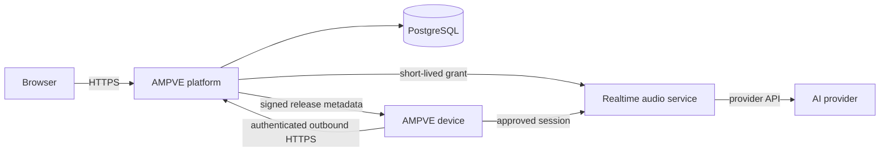

# AMPVE architecture

AMPVE separates the customer workspace, realtime AI services and embedded device runtime so each part has a clear security and lifecycle boundary.

## Platform

The Django application provides accounts, provider connections, device ownership, application assignments, configuration, diagnostics, deployment state and the visual console. PostgreSQL stores application state. Provider API keys are encrypted with key material held outside the database and repository.

The FastAPI/Pipecat service handles realtime provider sessions. The platform issues short-lived grants tied to an authenticated owner and provider connection; provider credentials are never embedded in firmware.

## Device runtime

AMPVE Core is the resident ESP-IDF runtime for each supported hardware profile. It owns:

- startup and recovery;
- board drivers and capability reporting;
- device enrollment and revocable credentials;
- authenticated configuration and heartbeat traffic;
- signed firmware updates;
- the local semantic interface; and
- authenticated visual-console sessions.

The device initiates network connections. A USB connection is needed for initial browser setup and recovery, not for ordinary Wi-Fi management.

## Application model

Companion is the first built-in native application because realtime audio and display behavior depend on board-specific drivers and timing.

AMPVE Core is also designed to host signed, bounded application packages. A portable package uses versioned capabilities, namespaced storage and declared resource limits, allowing it to coexist with Companion. Software that requires new drivers or unrestricted native access is delivered through a reviewed Core release.

## Release integrity

Firmware identity, compatibility and ordering are covered by signed release policy. A device downloads an approved image into its inactive application slot, verifies the complete artifact and reports the resulting identity after restart. Release signing keys and device backups remain outside the repository and application database.

See [Supported hardware](SUPPORTED_HARDWARE.md) for the current device boundary and [Security](../SECURITY.md) for the public security model.
